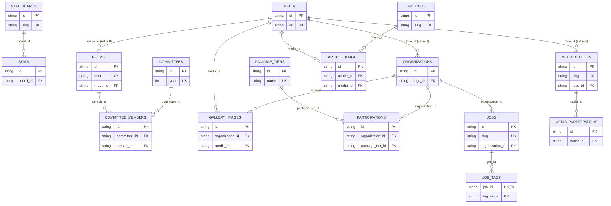

# ERD

```mermaid
erDiagram
  MEDIA {
    string id PK
    string url UK
  }

  STAT_BOARDS {
    string id PK
    string slug UK
  }

  STATS {
    string id PK
    string board_id FK
  }

  PEOPLE {
    string id PK
    string email UK
    string image_id FK
  }

  COMMITTEES {
    string id PK
    int year UK
  }

  COMMITTEE_MEMBERS {
    string id PK
    string committee_id FK
    string person_id FK
  }

  ORGANIZATIONS {
    string id PK
    string logo_id FK
  }

  GALLERY_IMAGES {
    string id PK
    string organization_id FK
    string media_id FK
  }

  PACKAGE_TIERS {
    string id PK
    string name UK
  }

  PARTICIPATIONS {
    string id PK
    string organization_id FK
    string package_tier_id FK
  }

  ARTICLES {
    string id PK
    string slug UK
  }

  ARTICLE_IMAGES {
    string id PK
    string article_id FK
    string media_id FK
  }

  JOBS {
    string id PK
    string slug UK
    string organization_id FK
  }

  JOB_TAGS {
    string job_id PK, FK
    string tag_value PK
  }

  MEDIA_OUTLETS {
    string id PK
    string slug UK
    string logo_id FK
  }

  MEDIA_PARTICIPATIONS {
    string id PK
    string outlet_id FK
  }

  STAT_BOARDS ||--o{ STATS : "board_id"

  MEDIA ||--o{ PEOPLE : "image_id (set null)"
  COMMITTEES ||--o{ COMMITTEE_MEMBERS : "committee_id"
  PEOPLE ||--o{ COMMITTEE_MEMBERS : "person_id"

  MEDIA ||--o{ ORGANIZATIONS : "logo_id (set null)"
  ORGANIZATIONS ||--o{ GALLERY_IMAGES : "organization_id"
  MEDIA ||--o{ GALLERY_IMAGES : "media_id"

  ORGANIZATIONS ||--o{ PARTICIPATIONS : "organization_id"
  PACKAGE_TIERS ||--o{ PARTICIPATIONS : "package_tier_id"

  ARTICLES ||--o{ ARTICLE_IMAGES : "article_id"
  MEDIA ||--o{ ARTICLE_IMAGES : "media_id"

  ORGANIZATIONS ||--o{ JOBS : "organization_id"
  JOBS ||--o{ JOB_TAGS : "job_id"

  MEDIA ||--o{ MEDIA_OUTLETS : "logo_id (set null)"
  MEDIA_OUTLETS ||--o{ MEDIA_PARTICIPATIONS : "outlet_id"
```

## View it

- VS Code: install a Mermaid preview extension, then preview this file.